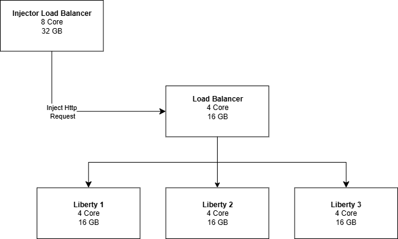
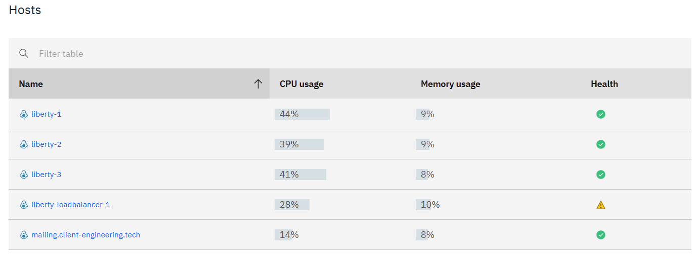
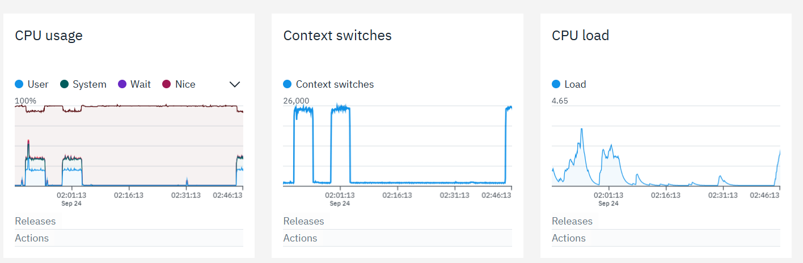
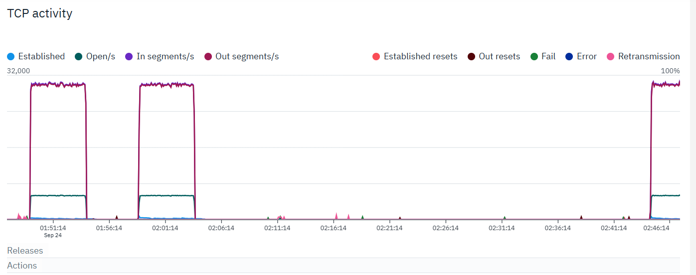

# Create HA for Liberty Server

We will demonstrate a High Availability (HA) setup using 1 VM running NGINX as the load balancer and 3 VMs running Liberty, with the following specifications:
 - Load Balancer VM: 4 cores, 16 GB memory
 - Liberty VMs: 4 cores, 16 GB memory each


For example load balancer configuration, you can refer to [upstream](Example%20Config/liberty-upstream.conf) and [proxy conf](Example%20Config/liberty-lb.conf)

## Load Test HA Architecture
In this section, we will perform load testing on the Liberty architecture described above. We will design the load test injector architecture as shown in the image below.


What we need to prepare:
- VM injector with spesification 8 core 32 GB.
- k6 loadtest tool
- simple endpoint (i only use simple endpoint on here)

### Setup for load balancer VM
1. Increase limit FD on Nginx
```
sudo mkdir -p /etc/systemd/system/nginx.service.d
sudo tee /etc/systemd/system/nginx.service.d/override.conf >/dev/null <<'EOF'
[Service]
LimitNOFILE=200000
EOF
sudo systemctl daemon-reload
```
2. Increase kernel limit
```
# total FD kernel
echo "fs.file-max = 500000" | sudo tee /etc/sysctl.d/90-fd.conf
sudo sysctl --system

echo -e "nginx soft nofile 200000\nnginx hard nofile 200000" | sudo tee -a /etc/security/limits.conf
```
3. Tuning Nginx (nginx.conf)
```
worker_processes auto;
worker_rlimit_nofile 200000;

events {
    use epoll;
    worker_connections 65535;
    multi_accept on;
}

http {
    ...
    keepalive_timeout 65s;
    keepalive_requests 100000;
    ...
}
```
restart nginx
```
sudo nginx -t && sudo systemctl restart nginx
```
4. Tuning kernel network
```
sudo tee /etc/sysctl.d/99-nginx-lb.conf >/dev/null <<'EOF'
net.core.somaxconn=65535
net.core.netdev_max_backlog=16384
net.ipv4.tcp_max_syn_backlog=16384
net.ipv4.ip_local_port_range=1024 65535
net.ipv4.tcp_fin_timeout=15
EOF
sudo sysctl --system
```
5. Tuning for injector VM
```
ulimit -n 100000
sudo sysctl -w net.ipv4.ip_local_port_range="1024 65535"
sudo sysctl -w net.ipv4.tcp_fin_timeout=15
```

## Result on loadtest
in this case: 
- I only use simple endpoint with size about 58 bytes.
- Try using 8.000 tps from injectors

Result: 
1. Result Performance API 

- RPS Achieved: http_reqs = 2,394,852 over 300s ⇒ 7,982 RPS (≈ target 8k), stable.
- Reliability: http_req_failed = 0.00% ✅
- Latency: p95 = 4.11 ms (very fast), median ~1.6 ms.
- Dropped Iterations: 5,149 (≈ 0.2%) — minimal, still acceptable for throughput testing.
- Virtual Users: vus_max = 2414 (k6 scaled VUs dynamically as needed to maintain the target rate).
2. Result Backend Performance

CPU usage across the entire architecture remained below 50%


There was a spike in CPU usage and system load, but it remained manageable.