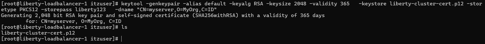
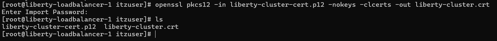
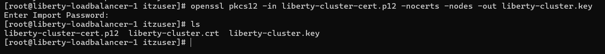

# Generate Self-Sign certificate on Liberty - RHEL 9
By default, Liberty’s SSL certificate may not always be visible. Therefore, when integrating with another load balancer (LB), it is often necessary to generate a new certificate.

This will demonstrate how to create an SSL certificate using the default Java library
1. install java & nginx
```
sudo dnf install -y java-17-openjdk java-17-openjdk-devel
sudo dnf install -y nginx
```
2. Make sure have **keytool** tools (create p12 file)
```
which keytool
```
3. Create p12 file
```
keytool -genkeypair -alias default -keyalg RSA -keysize 2048 -validity 365   -keystore liberty-cluster-cert.p12 -storetype PKCS12 -storepass liberty123   -dname "CN=myserver,O=MyOrg,C=ID"
```

4. Create certificate from p12 file
```
openssl pkcs12 -in liberty-cluster-cert.p12 -nokeys -clcerts -out liberty-cluster.crt
```


5. Move certificate and p12 files to liberty server
```
openssl pkcs12 -in liberty-cluster-cert.p12 -nocerts -nodes -out liberty-cluster.key
```

6. Put p12 file to liberty server 
```
mv liberty-cluster-cert.p12 /opt/wlp/usr/server/<SERVER_NAME>/resources/security/liberty-cluster-cert.p12
```
7. Put certificate and key on nginx folder
```
mv liberty-cluster.crt /etc/nginx/ssl/
mv liberty-cluster.key /etc/nginx/ssl/
```
8. Configure your nginx to proxy the request
[nginx-example](Example%20Config/nginx-example-proxy)

9. you can re-start your nginx server and liberty server
```
./wlp/bin/server start <SERVER_NAME>
systemctl restart nginx
```
now, you can access application from proxy load balancer