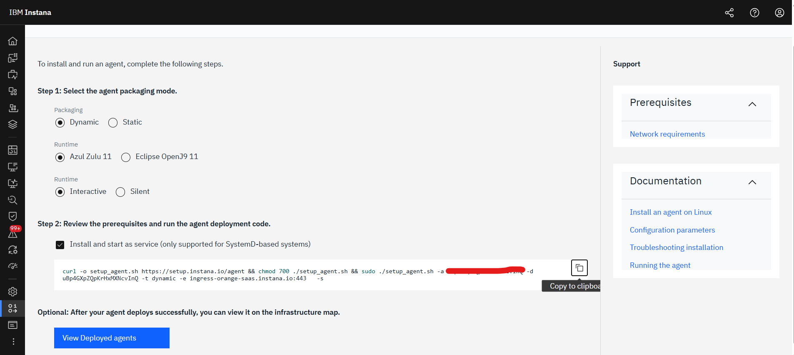
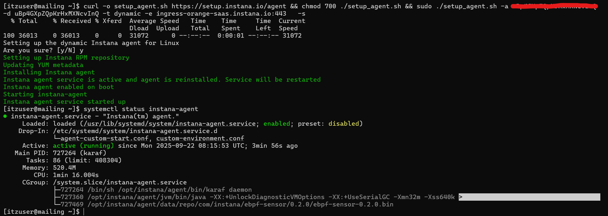
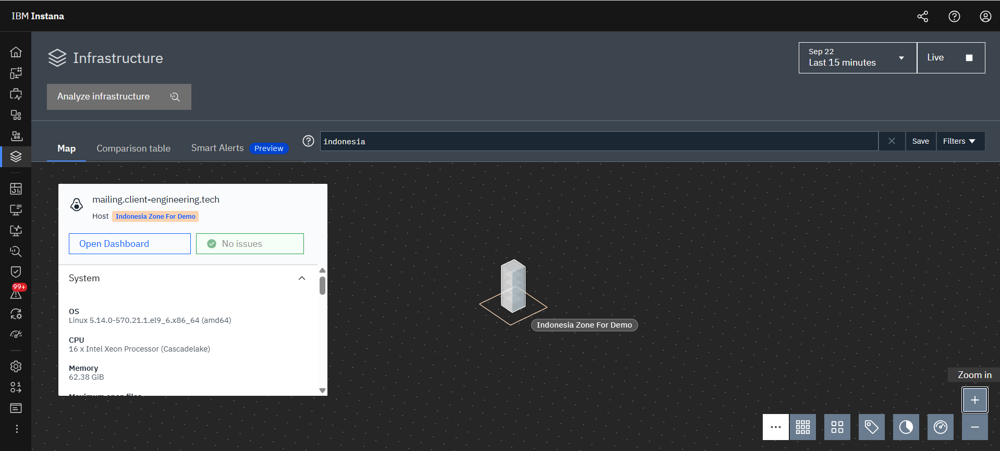
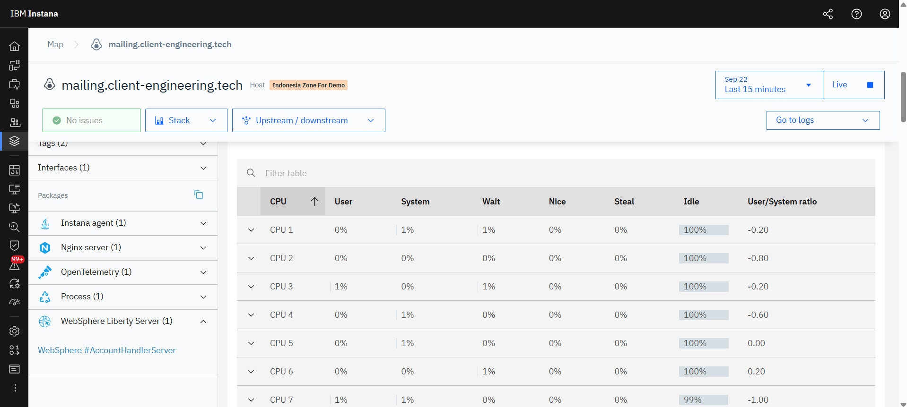
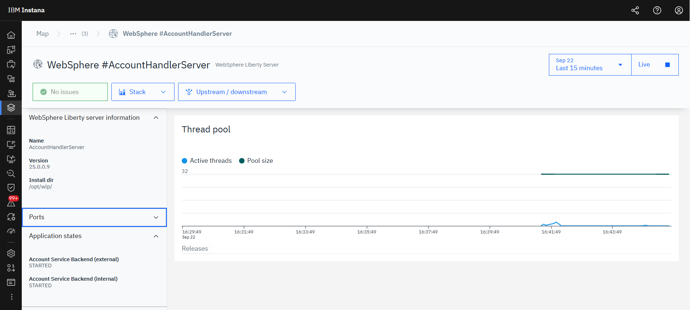
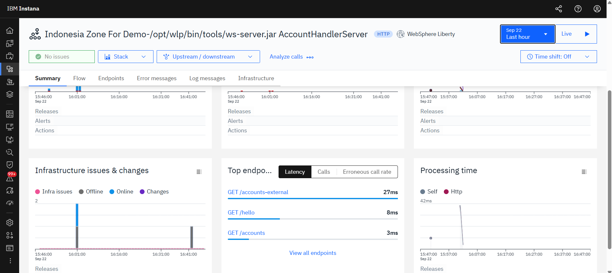
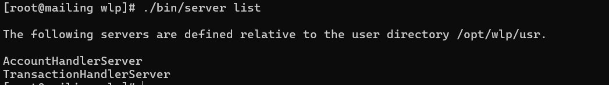
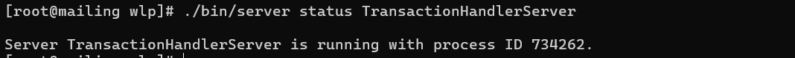

## How to integrated with APM (Instana)

in this section We will use example integration with instana case.
Flow will like this:
```
agent instana (get and send metrics) -> Instana Backend
```

1. On instana click **data source** -> search for **agent** -> choose your agent with spesification environment which you want to monitor.

2. in this case i use one liner installation. Run this command on liberty server.

get status code and all seems okay.


3. Configure instana to help you when filter it
For instana configuration: 
- add tag for your host
```
com.instana.plugin.host:
  tags:
    - 'techzone'
    - 'indonesia'
  collectInstalledSoftware: true
```
- add name for zone (grouping by infrastructure)
```
com.instana.plugin.generic.hardware:
  enabled: true
  availability-zone: 'Indonesia Zone For Demo'
```
For Liberty configuration:
- add monitoring feature on liberty by edit **server.xml**
```
    <featureManager>
        ...
        <feature>monitor-1.0</feature>
        ...
    </featureManager>
```
after change configuration, restart agent instana

4. After, installation we can see Liberty Application run from instana UI.
status of infra you can see through **infrastructure page**

you can get information about server, installed apps, and Liberty Service.

list service run on Liberty Server

metrics for app performance


## Monitor multiple server on Liberty(Optional)
1. We will try to add defined server on Liberty
- Add new server on Liberty (in this case i will name it **TransactionHandlerServer**)
```
    ./bin/server create TransactionHandlerServer
```
make sure port not conflict, and start the server.
2. Now, we have 2 server on 1 Liberty. You can check by using this command:
check list server:
```
./bin/server list
```

check status by this command
```
./bin/server status TransactionHandlerServer
```

3. Now, you can check application already automatic detect on instana.
multiple server on 1 liberty

not only server. but also, all service will automatically detected 
