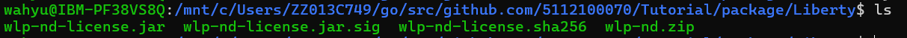
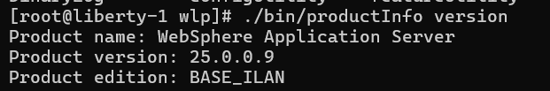
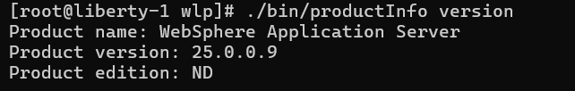
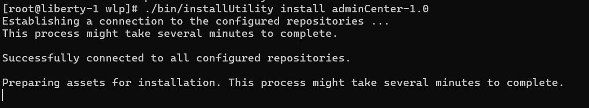
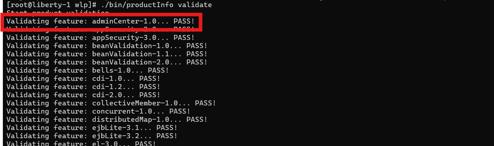
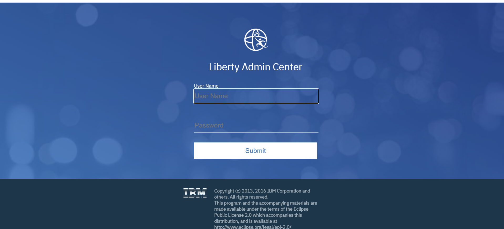
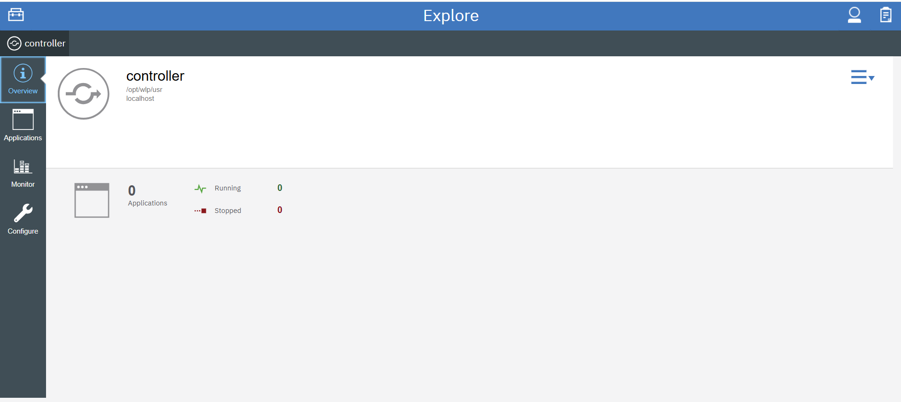

# Upgrade Liberty from base version to ND version

### Upgrading Liberty To ND Version
1. Download  **The wlp-nd.jar** file is used for upgrading an existing Liberty installation. [here](https://www.ibm.com/docs/en/was-liberty/nd?topic=archives-applying-license-liberty-installations)

2. Place the file on the server that you want to upgrade to the ND version.
3. Run **wlp-nd-license.jar** file.
```
java -jar wlp-nd-license.jar
```
Before

After


## Flow To Setup
### Planning

## How To Activate AdminCenter
[Documentation](https://www.ibm.com/docs/en/was-liberty/nd?topic=center-setting-up-admin)

After upgrading base to ND. Now you can activate Liberty AdminCenter.

1. Create controller server as base Admin Center.
```
bin/server create controller
bin/server start controller
```

2. Set controller server.xml
```
<server description="Liberty ND Controller with Admin Center">
    <featureManager>
        <feature>collectiveController-1.0</feature>
        <feature>adminCenter-1.0</feature>
        <feature>appSecurity-3.0</feature> <!-- atau 2.0 jika Java EE -->
    </featureManager>

    <basicRegistry id="basic" realm="adminRealm">
        <user name="admin" password="rahasia123"/>
        <group name="admins">
            <member name="admin"/>
        </group>
    </basicRegistry>

    <administrator-role>  <!-- beri hak admin untuk login ke Admin Center -->
        <user>admin</user>
    </administrator-role>

    <httpEndpoint id="defaultHttpEndpoint" host="*" httpPort="9080" httpsPort="9443"/>
</server>
```

3. During the upgrade, you may need to install the AdminCenter library
```
/bin/installUtility install adminCenter-1.0
```

and verify it
```
./bin/productInfo validate
```

Make sure **adminCenter-1.0** listed on there.

4. Restart Server
```
    bin/server stop controller
    bin/server start controller
```

5. You can now access the server. The username and password can be found in the server.xml file that you configured earlier.
```
https://YOUR_DOMAIN:9443/adminCenter
```

After Login


Your Liberty now upgraded and Admin Center ready to use.
## Note: 
- A single Liberty ND node can act as the collective controller and manage multiple Liberty Base nodes as collective members (including forming a Liberty ‘cluster’). The controller must be ND, but the members can be Base/Core. [Documentation](https://www.ibm.com/docs/en/was-liberty/nd?topic=collectives-collective-architecture)