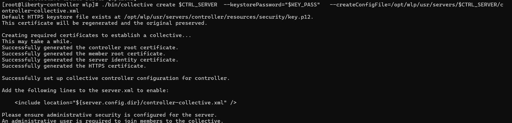

# Implement Cluster on Liberty

Liberty supports clustering, which is primarily used to manage multiple Liberty servers. In this tutorial, I will demonstrate how to implement and use this capability.

[Liberty Documentation](https://www.ibm.com/docs/en/was-liberty/nd?topic=collectives-setting-up-liberty-server-clusters)

## Steps

### 1. Simple Architecture Cluster Liberty


you need to pay attention on [Prerequisite](ND%20-%20Prerequisite%20Liberty%20Simple%20Cluster.md)

### 2. Setup Parameter (Optional)
In my view, it is important to prepare the parameters in advance to avoid incorrect values during implementation.
Set this value on **/etc/environment** file on each controller and member.
```
# ===== CONTROLLER =====
CTRL_HOST=liberty-controller.local
CTRL_IP=162.133.143.36          # ganti sesuai IP controller
CTRL_SERVER=controller
ADMIN_USER=admin                # username unk adminCenter
ADMIN_PASS='rahasia123'         # password unk adminCenter
KEY_PASS='liberty123'           # password utk keystore/truststore

# ===== MEMBER-1 =====
MEM1_HOST=liberty-member-1.local
MEM1_IP=162.133.133.77          # ganti sesuai IP member-1
MEM1_SERVER=AccountHandlerServer
```

### 3. Prepare /etc/hosts (OPTIONAL)
If you want to use an internal DNS, you must ensure that each environment can communicate with it.
- config on controller and member
```
echo "$CTRL_IP  $CTRL_HOST"   | sudo tee -a /etc/hosts
echo "$MEM1_IP  $MEM1_HOST"   | sudo tee -a /etc/hosts
```

### 4. Configure CONTROLLER – (Server, SSL, Collective)
- Create server controller
```
./bin/server create "$CTRL_SERVER"
```
- Instal needed feature
```
./bin/installUtility install collectiveController-1.0 adminCenter-1.0 restConnector-2.0
```
- After done install needed feature, you need to add some config on **controller** `server.xml`
```
<featureManager>
    <feature>collectiveController-1.0</feature>
    <feature>adminCenter-1.0</feature>
    <feature>restConnector-2.0</feature>
    <feature>appSecurity-3.0</feature>
</featureManager>

...

<basicRegistry id="basic" realm="adminRealm">
    <user name="admin" password="rahasia123"/>
    <group name="admins">
       <member name="admin"/>
    </group>
</basicRegistry>

<administrator-role>
    <user>admin</user>
</administrator-role>
```
- Create certificate HTTPS controller
```
./bin/securityUtility createSSLCertificate \
  --server="$CTRL_SERVER" \
  --password="$KEY_PASS" \
  --validity=825 \
  --subject="CN=$CTRL_HOST,O=MyOrg,C=ID" \
  --extInfo="san=dns:$CTRL_HOST,ip:$CTRL_IP,dns:localhost,ip:127.0.0.1"
```
After run this command, you will instructed to add this example code to your server.xml
```
Add the following lines to the server.xml to enable SSL:

    <featureManager>
        <feature>transportSecurity-1.0</feature>
    </featureManager>
    <keyStore id="defaultKeyStore" password="{xor}MzY9Oi0rJm5tbA==" />
```


- Initiate controller as Collective Controller
```
./bin/collective create $CTRL_SERVER  --keystorePassword="$KEY_PASS"   --createConfigFile=/opt/wlp/usr/servers/$CTRL_SERVER/controller-collective.xml
```
- That command will result file **controller-collective.xml** which you need to add on server.xml
```
<include location="${server.config.dir}/controller-collective.xml" />
```

- set SSL controller → member use collectiveTrust

Edit /opt/wlp/usr/servers/$CTRL_SERVER/controller-collective.xml. File must contains:
```
<variable name="defaultHostName" value="liberty-controller.local"/>

<ssl id="defaultSSLConfig"
     keyStoreRef="serverIdentity"
     trustStoreRef="collectiveTrust"
     clientAuthenticationSupported="true"/>
<sslDefault sslRef="defaultSSLConfig"/>
```
This means all outbound connection (controller → member) using truststore collectiveTrust.
- Start & verifikasi controller
Restart controller server
```
./server stop "$CTRL_SERVER"
./server start "$CTRL_SERVER"
```
Make sure certificate is right
```
openssl s_client -connect $CTRL_HOST:9443 -servername $CTRL_HOST </dev/null 2>/dev/null \
  | openssl x509 -noout -text | grep -A2 "Subject Alternative Name"
```
- You Admin Page can open now
```
https://liberty-controller.local:9443/adminCenter
```
you can find my example [server.xml](Example%20Config/cluster-nd/server.xml) and [controller-collective.xml](Example%20Config/cluster-nd/server.xml)


### 5. Create and Assign MEMBER
Run this command on **member server**.
- Create server and generate its certificate
```
/opt/wlp/bin/server create "$MEM1_SERVER"

/opt/wlp/bin/securityUtility createSSLCertificate \
  --server="$MEM1_SERVER" \
  --password="$KEY_PASS" \
  --validity=825 \
  --subject="CN=$MEM1_HOST,O=MyOrg,C=ID" \
  --extInfo "san=dns:$MEM1_HOST,ip:$MEM1_IP,dns:localhost,ip:127.0.0.1"
```

- Edit server.xml for member
Atleast on your server.xml must have this value.
```
<server description="Member-1">
  <featureManager>
    <feature>webProfile-8.0</feature>
    <feature>restConnector-2.0</feature>
    <feature>collectiveMember-1.0</feature>
    <feature>monitor-1.0</feature>
  </featureManager>

  <!-- hostname which Controller will see -->
  <variable name="defaultHostName" value="liberty-member-1.local"/>

  <!-- HTTPS endpoint -->
  <httpEndpoint id="defaultHttpEndpoint" host="*" httpPort="9080" httpsPort="9443"/>

  <!-- Keystore/truststore inbound HTTPS -->
  <keyStore id="defaultKeyStore"  location="${server.config.dir}/resources/security/key.p12"
            type="PKCS12" password="liberty123"/>
  <keyStore id="defaultTrustStore" location="${server.config.dir}/resources/security/trust.p12"
            type="PKCS12" password="liberty123"/>
  <ssl id="defaultSSLConfig" keyStoreRef="defaultKeyStore" trustStoreRef="defaultTrustStore"/>
  <sslDefault sslRef="defaultSSLConfig"/>
</server>
```
- Joining MEMBER ke controller
```
./bin/collective join "$MEM1_SERVER" \
  --host="$CTRL_HOST" --port=9443 \
  --user="$ADMIN_USER" --password="$ADMIN_PASS" \
  --keystorePassword="$KEY_PASS" \
  --autoAcceptCertificates
```

you need to add this element on server.xml if still not showing
```
<collectiveMember controllerHost="liberty-controller.local" controllerPort="9443"/>
```
- Restart Member
```
./bin/server stop "$MEM1_SERVER"
./bin/server start "$MEM1_SERVER"
```
Check connectivity from controller to member
```
curl -vk https://$MEM1_HOST:9443/IBMJMXConnectorREST/mbeans | head
```
You can find my example config [server.xml](Example%20Config/cluster-nd/server-member.xml)
- Finally you can see your server and application, monitored on liberty dashboard.


## Notes
Why Liberty clustering is beneficial:
- Centralized management: A single Liberty ND (Network Deployment) controller can manage multiple Liberty Base servers as collective members.
- High availability (HA): If one Liberty server goes down, the workload can failover to other active servers, ensuring service continuity.
- Scalability: You can easily add more Liberty nodes to handle increasing workloads without major reconfiguration.
- Flexibility: Controllers must run Liberty ND, but members can remain on Liberty Base/Core, making it cost-efficient.
- Simplified monitoring & administration: With Admin Center and REST connectors, Liberty provides a unified dashboard to monitor health, performance, and clusters.