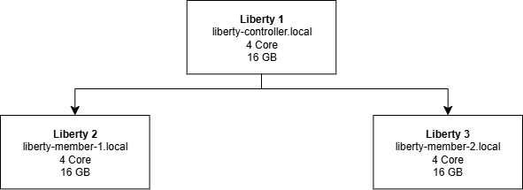

# Prerequisite Liberty Simple Cluster

Imagine you want to create a simple cluster. There are several key points you need to pay attention to, including:

### Design Cluster


Ensure two-way name resolution:
- The controller must be able to resolve the members.
- The members must be able to resolve the controller.

Ensure required ports are open:
- 9443 (Liberty HTTPS)
- 9080 (optional)

Firewalls between VMs must allow two-way access.

It is recommended to have a DNS, since the cluster relies on certificates for communication.

### Cleanup/Reset (Easy way fixing incase you want to reset config):
- Stop all Liberty servers.
- Delete the old server directories (controller & members), along with the resources/collective and resources/security folders if you want a full reset.
- Ensure no processes are still bound to ports 9443/9080.

### Provisioning the Controller
- Create the “controller” server.
- Configure the following features:
```
1. collectiveController-1.0
2. adminCenter-1.0
3. restConnector-2.0
4. appSecurity-3.0
```
- Set the endpoints:
```
host="*"
httpPort=9080
httpsPort=9443
```
- Add an admin user using basicRegistry and assign the administrator role.
- Generate an inbound controller certificate with proper SAN values:
```
CN and SAN = controller FQDN
Include the IP address as well
```

- Initialize the collective (generate an include file), then reference this include file from server.xml (avoid self-inclusion).
- Ensure the default SSL for the server uses the controller’s identity.
- Verify from another machine:
  1. Confirm the controller certificate is valid (check SAN).
  2. Ensure the controller’s REST JMX endpoint is accessible.
  3. Confirm Admin Center can be accessed directly on the controller (without load balancer).

### Provisioning Member (tiap server aplikasi)
- Buat server aplikasi (mis. AccountHandlerServer).
- Konfigurasi feature minimal 
```
1. collectiveMember-1.0
2. restConnector-2.0
3. monitor-1.0
```
- Set defaultHostName menjadi nama yang akan dipakai controller untuk menghubungi member
- Buat sertifikat inbound member dengan SAN yang cocok (DNS = hostname member, plus IP).
- Set endpoint: host="*"; httpsPort=9443.

### Joining a Member to the Controller
- Run the join process from the member node directly to the controller (not through Nginx or any load balancer).
- Choose whether to accept the certificate automatically (auto-accept) or manage the trust manually.
- After the join is complete, ensure that the SSL configuration for the member’s connection to the controller points to the collective keystore/truststore created during the join process.

### End-to-End Validation
- From the controller, check TLS connectivity to:
```
https://<member>:9443/IBMJMXConnectorREST/...
```
- Review the messages.log on both the controller and the member to ensure there are no SSLHandshake or UnknownHost errors.
- Open Admin Center → Refresh; the member’s status should appear as Running.
